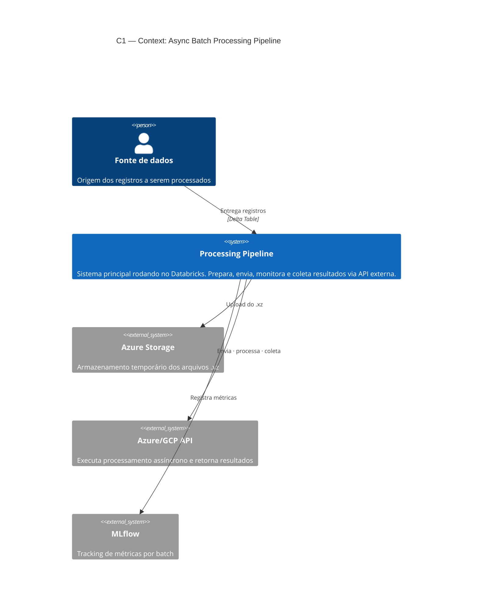
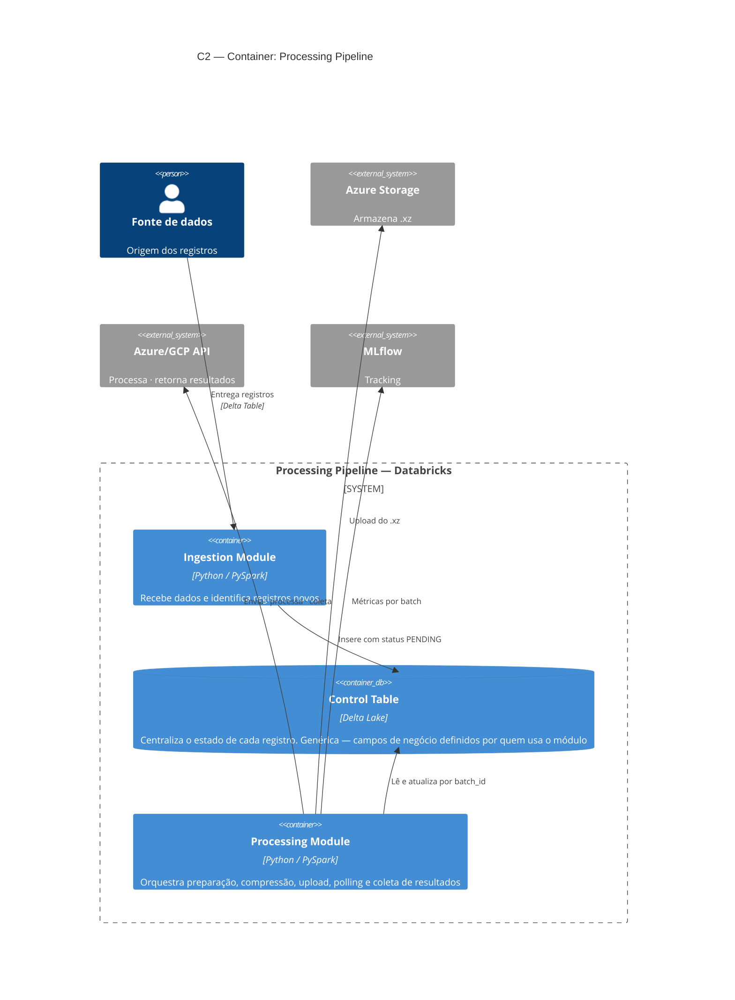

# Architecture Document
**Async Batch Processing Pipeline — Databricks**
Versão 1.0 · C4 Model

---

## C1 — Context

Visão de mais alto nível do sistema. Mostra o pipeline como uma unidade, os atores externos que interagem com ele e os sistemas de terceiros envolvidos.

---

## C2 — Container

Decompõe o sistema principal em containers — os processos e estruturas de dados que o compõem.

