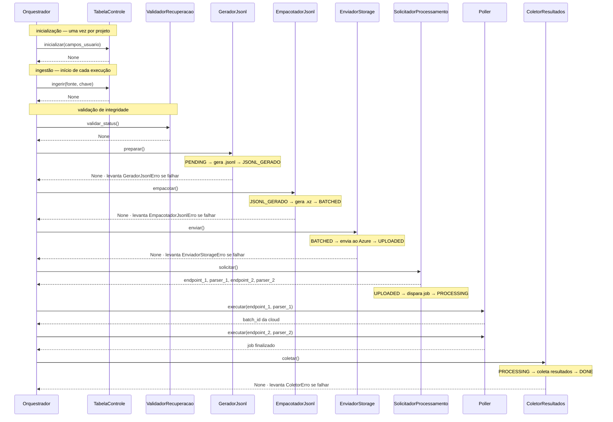

# C3 — Component
**Async Batch Processing Pipeline — Databricks**

Detalha os componentes internos do Processing Module.

---

## Responsabilidades por componente

| Componente | Tipo | Responsabilidade |
|-----------|------|-----------------|
| `Orquestrador` | Principal | Instancia e coordena todos os componentes em sequência |
| `TabelaControle` | Central | Cria tabela, ingere dados novos via streaming, expõe instância DeltaTable via `obter()` |
| `GeradorJsonl` | Principal | Consulta PENDING, atribui batch_ids, gera .jsonl, atualiza status = JSONL_GERADO. Implementa `IValidavel` |
| `EmpacotadorJsonl` | Principal | Consulta JSONL_GERADO, compacta em .xz com validação, deleta .jsonl, atualiza status = BATCHED. Implementa `IValidavel` |
| `EnviadorStorage` | Principal | Consulta BATCHED, envia .xz ao Azure, atualiza path e status. Implementa `IValidavel` |
| `SolicitadorProcessamento` | Principal | Dispara job na API, centraliza endpoints e parsers para o Poller. Implementa `IValidavel` |
| `Poller` | Principal | Polling genérico — recebe endpoint e parser, chamado 2x pelo orquestrador |
| `ColetorResultados` | Principal | Coleta resultados do job finalizado e salva por linha na Control Table |
| `IValidavel` | Interface | Contrato de validação de integridade implementado por cada componente principal |
| `ValidadorRecuperacao` | Transversal | Chama `IValidavel` de cada componente, reseta inválidos para PENDING ou marca ERRO_GLOBAL |
| `MonitorMLflow` | Transversal | Registra métricas do batch no MLflow após envio para a API |

---

## Sequência de chamadas pelo orquestrador



---

## Organização de pastas no volume

```
/Volume/path/processamento_ia/       ← Compartilhado.obter("volume_ia")
  jsonl/
    {batch_id}/
      data.jsonl
  xz/
    {timestamp}_{hash}.xz
```

---

## Injeção de dependência

Todos os componentes recebem a `TabelaControle` no construtor. Nenhum componente conhece o nome da tabela — só opera sobre a instância recebida.

```
TabelaControle → injetada em todos os componentes
Compartilhado  → acessado estaticamente para volume, schemas
```
