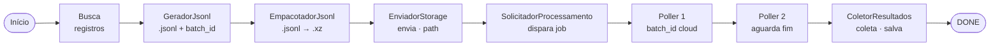
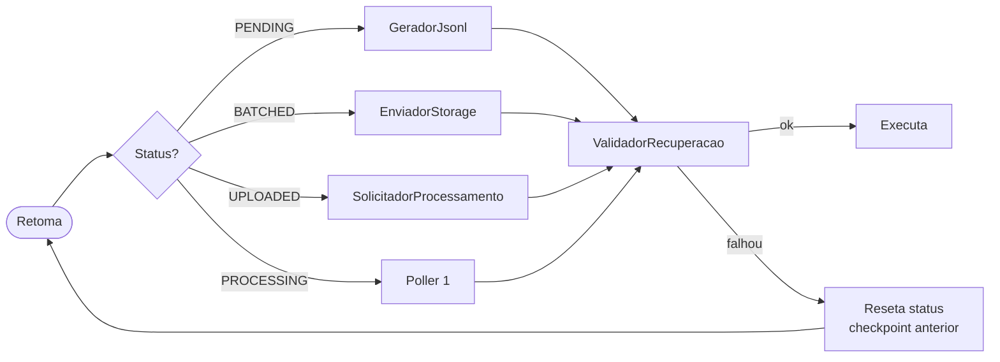
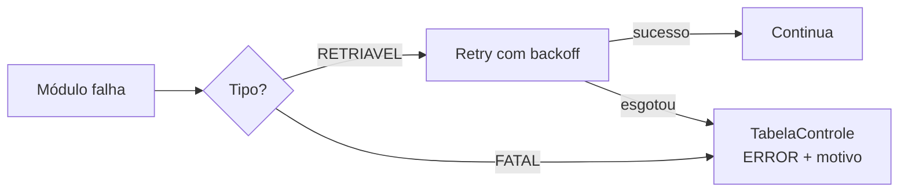

# Fluxos de Execução
**Async Batch Processing Pipeline — Databricks**

---

## Caminho feliz

```mermaid
flowchart LR
    A([Início]) --> B[Busca\nregistros]
    B --> C[GeradorJsonl\n.jsonl + batch_id]
    C --> D[EmpacotadorJsonl\n.jsonl → .xz]
    D --> E[EnviadorStorage\nenvia · path]
    E --> F[SolicitadorProcessamento\ndispara job]
    F --> G[Poller 1\nbatch_id cloud]
    G --> H[Poller 2\naguarda fim]
    H --> I[ColetorResultados\ncoleta · salva]
    I --> J([DONE])
```

---

## Retomada por status

```mermaid
flowchart LR
    A([Retoma]) --> B{Status?}

    B -->|PENDING| C[GeradorJsonl]
    B -->|BATCHED| D[EnviadorStorage]
    B -->|UPLOADED| E[SolicitadorProcessamento]
    B -->|PROCESSING| F[Poller 1]

    C & D & E & F --> G[ValidadorRecuperacao]
    G -->|ok| H[Executa]
    G -->|falhou| I[Reseta status\ncheckpoint anterior]
    I --> A
```

---

## Tratamento de erros

```mermaid
flowchart LR
    A[Módulo falha] --> B{Tipo?}
    B -->|RETRIAVEL| C[Retry com backoff]
    C -->|sucesso| D[Continua]
    C -->|esgotou| E[TabelaControle\nERROR + motivo]
    B -->|FATAL| E
```
