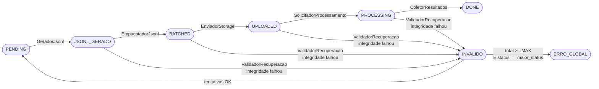
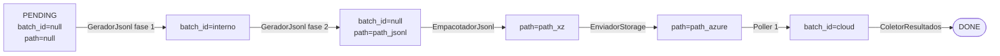

# Control Table
**Async Batch Processing Pipeline — Databricks**

Tabela Delta genérica que centraliza o estado de cada registro ao longo do pipeline. Os campos de negócio são definidos por quem usa o módulo.

---

## Campos

| Campo | Tipo | Descrição | Observação |
|-------|------|-----------|------------|
| *(campos do usuário)* | variável | Definidos por quem usa o módulo (ex: id_audio, modelo, prompt) | Livres |
| `status` | string | Etapa atual do registro no pipeline | Ver tabela de status |
| `batch_id` | string | Campo de trabalho — ID interno durante GeradorJsonl, sobrescrito pelo batch_id da cloud após Poller 1 | Limpo ao final do GeradorJsonl · reutilizado pela cloud |
| `path` | string | Campo de trabalho — path do arquivo atual (.jsonl → .xz → resultado) | Sobrescrito por etapa |
| `data_atualizacao` | timestamp | Timestamp da última atualização de status | Auditoria e debugging |
| `erro` | string | Motivo do erro caso o registro tenha falhado | Nullable |
| `total_tentativas` | int = 0 | Contador acumulado de falhas de recuperação | Nunca reseta |
| `maior_status` | string = null | Status mais avançado já atingido pelo registro | Nunca regride |

---

## Status

| Status | Significado | Próxima etapa | Quem atualiza |
|--------|-------------|---------------|---------------|
| `PENDING` | Registro aguardando processamento | GeradorJsonl | TabelaControle |
| `JSONL_GERADO` | .jsonl criado · aguardando empacotamento | EmpacotadorJsonl | TabelaControle |
| `BATCHED` | .xz criado e pronto para upload | EnviadorStorage | TabelaControle |
| `UPLOADED` | Arquivo enviado ao Azure | SolicitadorProcessamento | TabelaControle |
| `PROCESSING` | Job submetido · aguardando resultado | Poller → ColetorResultados | TabelaControle |
| `DONE` | Resultado coletado e salvo | — | TabelaControle |
| `INVALIDO` | Temporário · integridade falhou · aguarda decisão do ValidadorRecuperacao | ValidadorRecuperacao | Componente |
| `ERRO_GLOBAL` | Excedeu tentativas · requer intervenção manual · ignorado pelo pipeline | — | ValidadorRecuperacao |

---

## Regra de progressão de status

O Orquestrador só busca registros em status acionáveis:

```sql
SELECT WHERE status IN (PENDING, JSONL_GERADO, BATCHED, UPLOADED, PROCESSING)
```

`INVALIDO` é temporário — nunca persiste entre execuções.
`ERRO_GLOBAL` é permanente — só sai com intervenção manual.

---

## Regra de ERRO_GLOBAL

```
total_tentativas >= MAX_TENTATIVAS AND status_atual == maior_status → ERRO_GLOBAL
```

`MAX_TENTATIVAS` é uma constante interna do `ValidadorRecuperacao`.

---

## Ciclo de vida do status



---

## Ciclo de vida do batch_id e path


