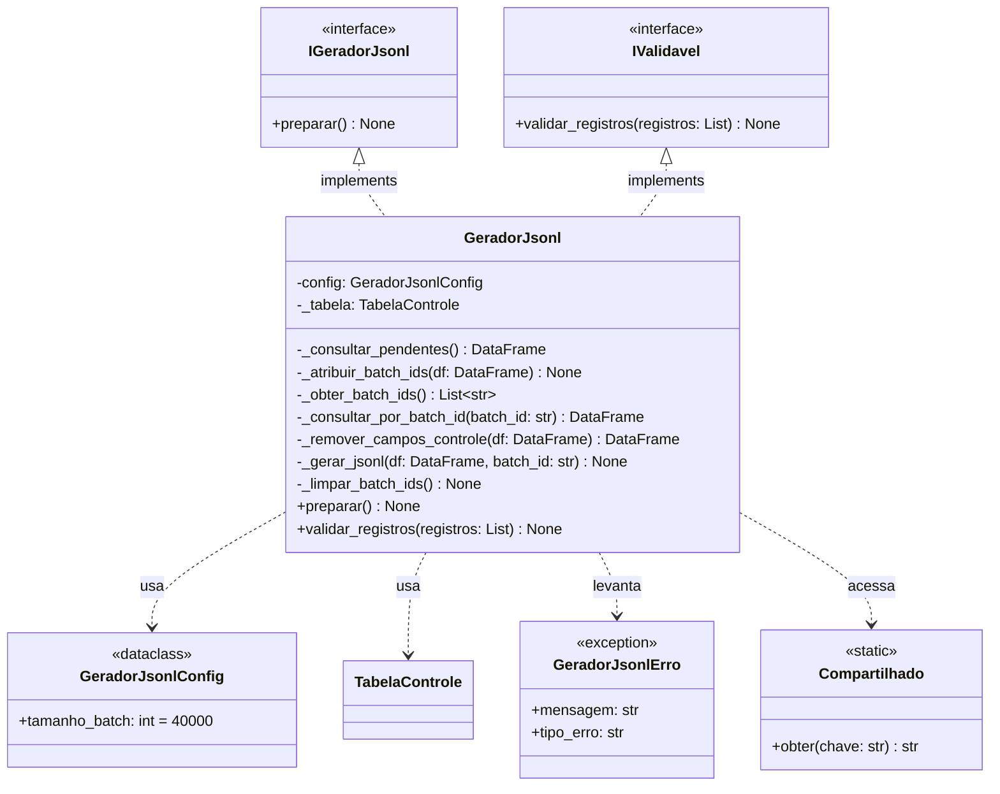
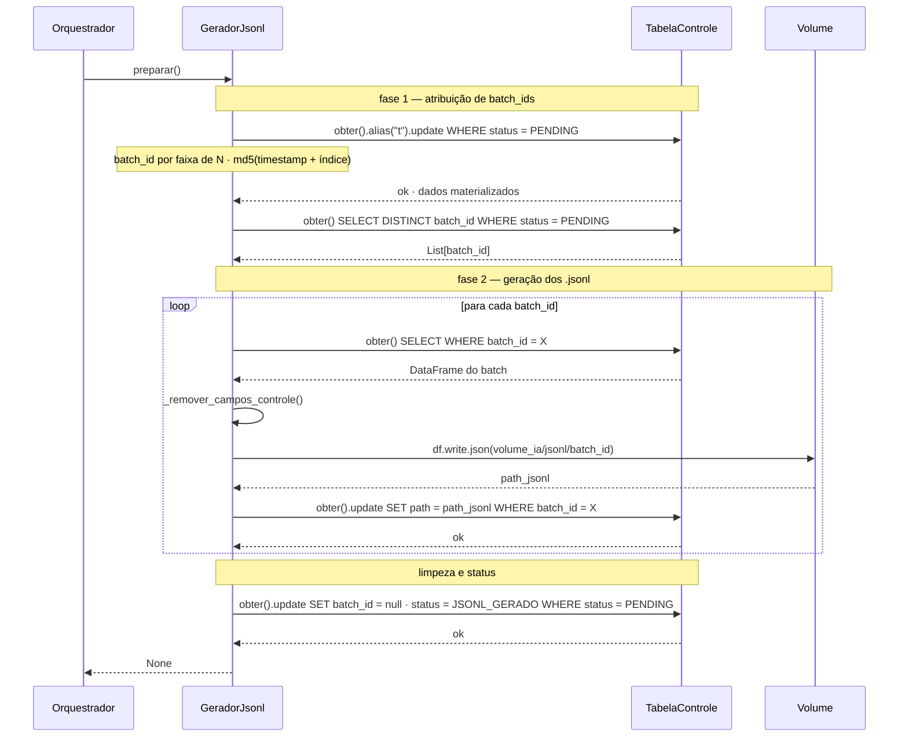
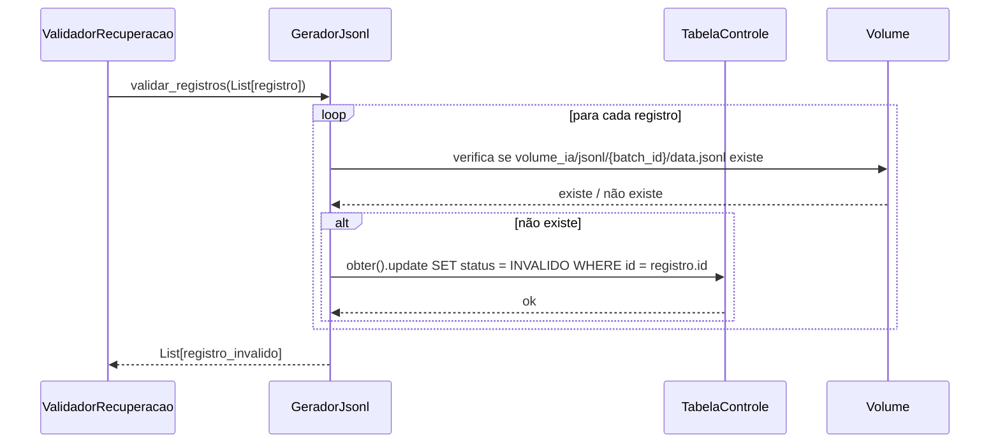

# C4 — GeradorJsonl
**Async Batch Processing Pipeline — Databricks**

---

## Diagrama de classes

---

## Diagrama de sequência — preparar()

---

## Diagrama de sequência — validar_registros()

---

## Decisões de design

- **Sem `collect()`** — todas as operações são distribuídas via Spark
- **Duas fases separadas** — fase 1 materializa os batch_ids antes da fase 2 iniciar, evitando lazy evaluation do Spark
- **`batch_id` limpo ao finalizar** — campo de trabalho temporário, null após `preparar()` concluir
- **Status atualizado pelo próprio componente** — `GeradorJsonl` atualiza para `JSONL_GERADO` ao final, pois é o único com contexto completo
- **`caminho_volume` via `Compartilhado.obter("volume_ia")`** — subpath `/jsonl/{batch_id}`
- **Sem `nome_tabela` na config** — acessa a tabela via `TabelaControle` injetada no construtor
- **Implementa `IValidavel`** — verifica se `.jsonl` existe no volume para cada registro em `JSONL_GERADO`
