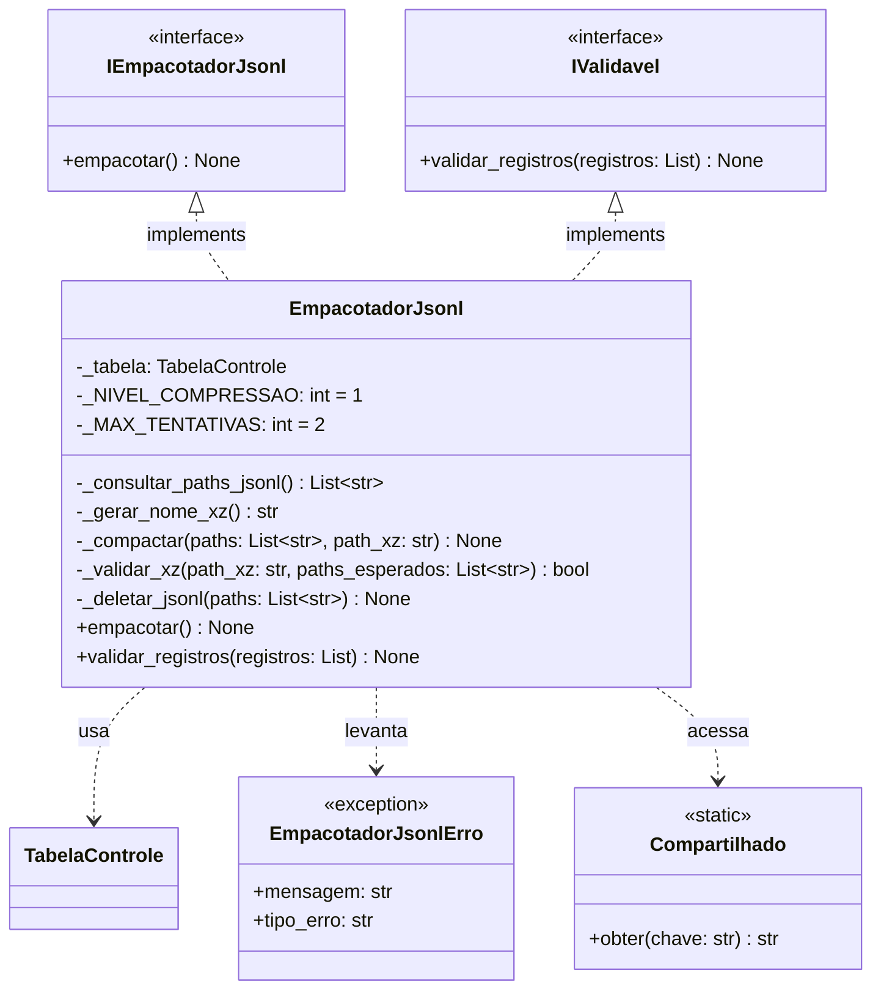
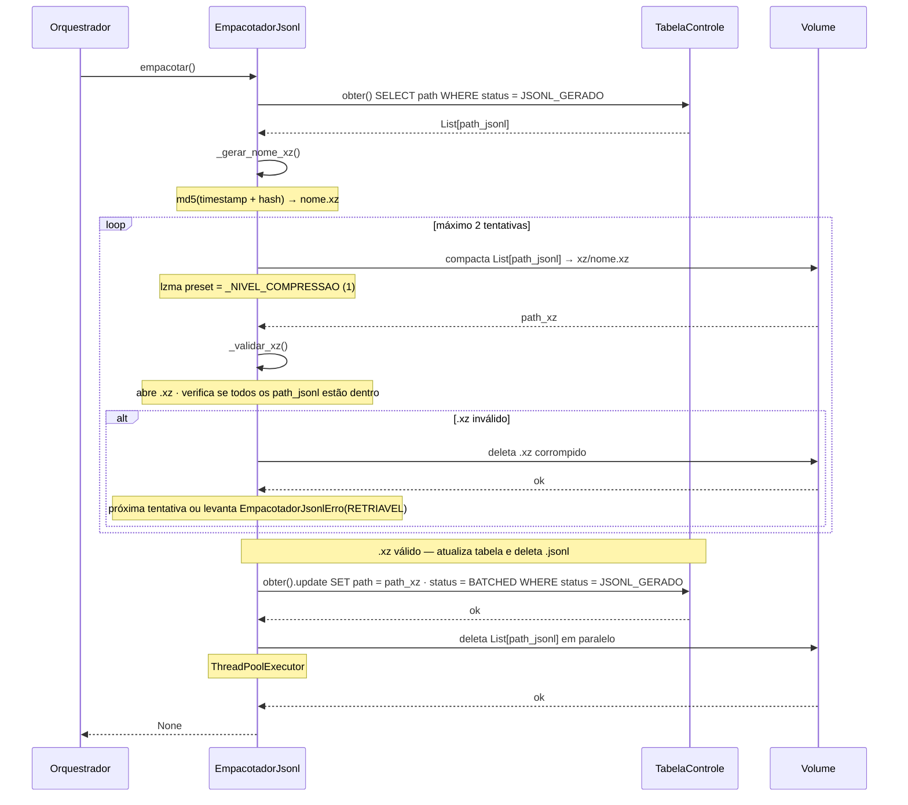
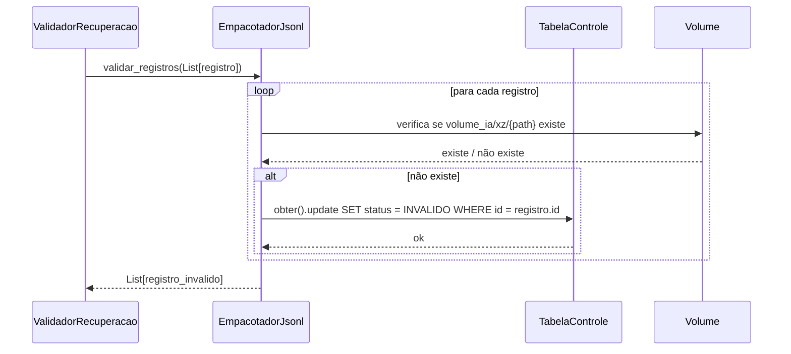

# C4 — EmpacotadorJsonl
**Async Batch Processing Pipeline — Databricks**

---

## Diagrama de classes

---

## Diagrama de sequência — empacotar()

---

## Diagrama de sequência — validar_registros()

---

## Decisões de design

- **Sem config** — `EmpacotadorJsonl` não tem `EmpacotadorJsonlConfig`. Recebe só a `TabelaControle`
- **Consulta `JSONL_GERADO`** — lê registros que o `GeradorJsonl` terminou de processar
- **Status atualizado pelo próprio componente** — atualiza para `BATCHED` ao final, pois é o único com contexto do `.xz`
- **`_NIVEL_COMPRESSAO = 1`** — constante interna. Nível 1 do LZMA para melhor performance
- **`_MAX_TENTATIVAS = 2`** — constante interna. Falha duas vezes indica problema estrutural
- **Validação do conteúdo do .xz** — abre e verifica se todos os path_jsonl esperados estão presentes
- **Deleção só após .xz validado** — .jsonl permanecem intactos até confirmação
- **Deleção em paralelo** — `ThreadPoolExecutor`
- **Implementa `IValidavel`** — verifica se `.xz` existe no volume para cada registro em `BATCHED`
