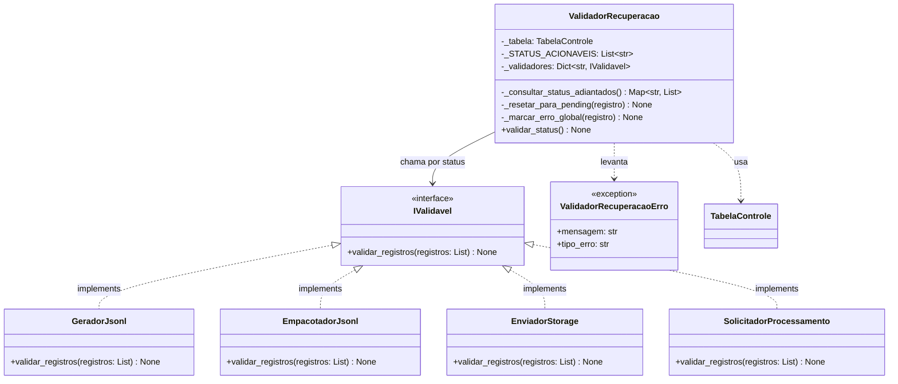
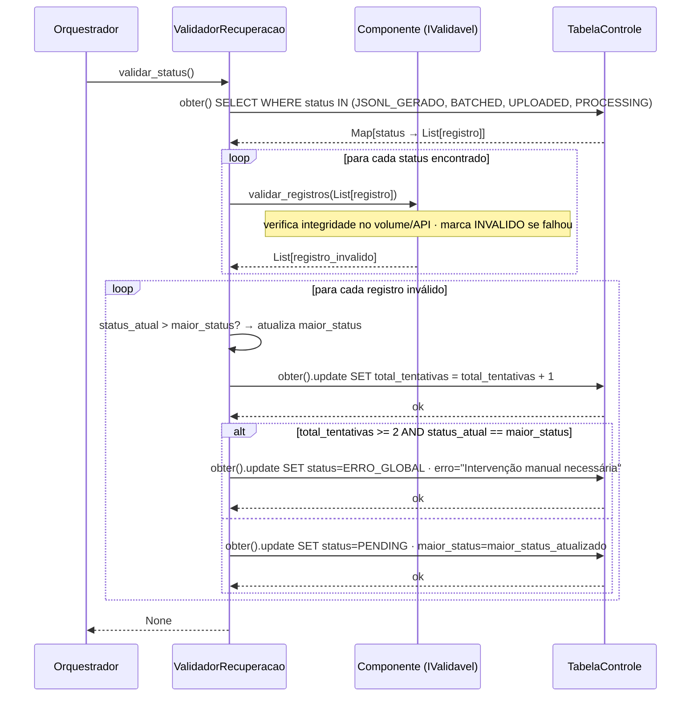

# C4 — ValidadorRecuperacao
**Async Batch Processing Pipeline — Databricks**

---

## Diagrama de classes



---

## Diagrama de sequência



---

## Mapeamento status → componente validador

| Status | Componente validador | O que verifica |
|--------|---------------------|----------------|
| `JSONL_GERADO` | `GeradorJsonl` | .jsonl existe no volume |
| `BATCHED` | `EmpacotadorJsonl` | .xz existe no volume |
| `UPLOADED` | `EnviadorStorage` | .xz existe no Azure |
| `PROCESSING` | `SolicitadorProcessamento` | job_id existe na API |

---

## Regra de ERRO_GLOBAL

```
total_tentativas >= 2 AND status_atual == maior_status → ERRO_GLOBAL
```

---

## Decisões de design

- **Sem config** — `ValidadorRecuperacao` recebe só a `TabelaControle` e os componentes `IValidavel`
- **`IValidavel`** — cada componente conhece suas próprias regras de integridade
- **`INVALIDO` é temporário** — nunca persiste entre execuções
- **`ERRO_GLOBAL` é permanente** — requer intervenção manual
- **`maior_status` nunca regride** — garante detecção de reincidência na etapa mais avançada
- **`total_tentativas` nunca reseta** — acumula todas as falhas
