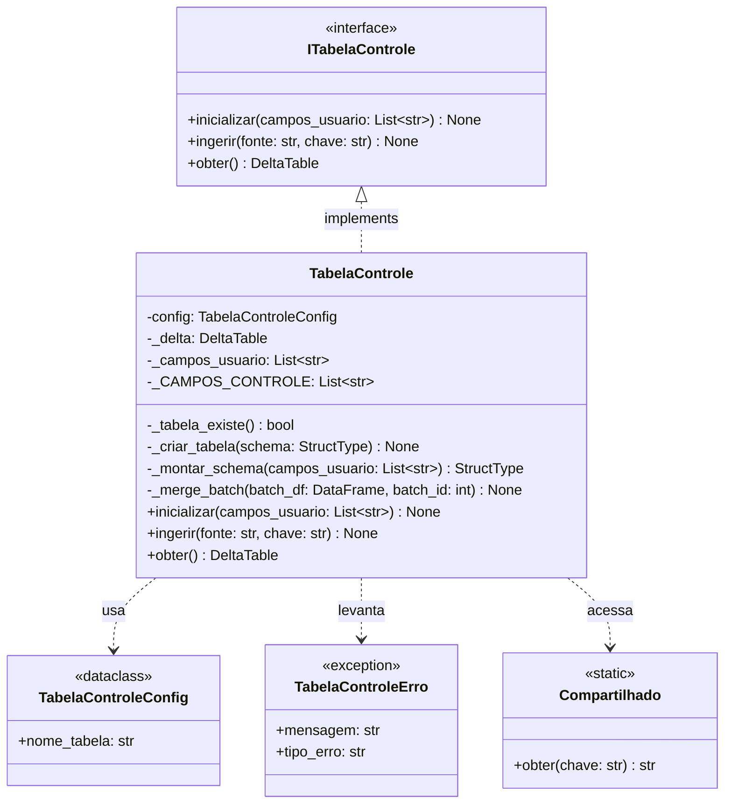
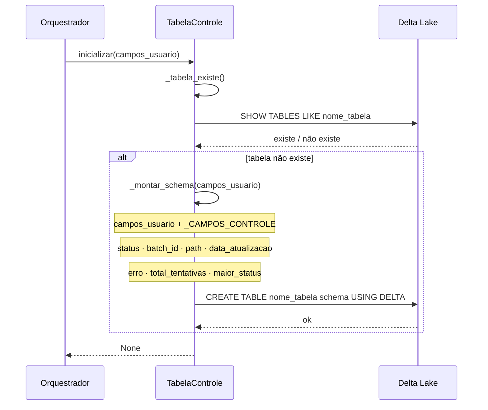
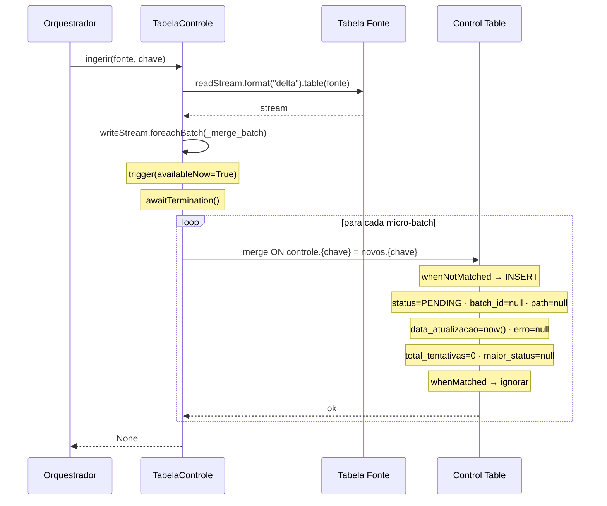

# C4 — TabelaControle
**Async Batch Processing Pipeline — Databricks**

---

## Diagrama de classes

---

## Diagrama de sequência — inicializar()

---

## Diagrama de sequência — ingerir()

---

## Campos de controle obrigatórios

Adicionados automaticamente pelo `inicializar()` independente dos campos do usuário:

| Campo | Tipo | Default | Descrição |
|-------|------|---------|-----------|
| `status` | string | `PENDING` | Etapa atual do registro |
| `batch_id` | string | null | Campo de trabalho — ID do batch |
| `path` | string | null | Campo de trabalho — path do arquivo atual |
| `data_atualizacao` | timestamp | now() | Timestamp da última atualização |
| `erro` | string | null | Motivo do erro se houver |
| `total_tentativas` | int | 0 | Contador acumulado de falhas de recuperação |
| `maior_status` | string | null | Status mais avançado já atingido |

---

## Decisões de design

- **`inicializar()` é idempotente** — verifica se tabela existe antes de criar. Pode ser chamado múltiplas vezes sem efeito colateral
- **`ingerir()` usa `trigger(availableNow=True)`** — processa todos os registros novos disponíveis e encerra. Adequado para pipelines com execução diária
- **`ingerir()` usa merge com `whenNotMatched`** — registros já existentes são ignorados, nunca duplicados
- **`obter()` retorna a instância `DeltaTable`** — componentes usam para fazer seus próprios updates com contexto específico
- **`nome_tabela` só em `TabelaControleConfig`** — nenhum outro componente conhece o nome da tabela
- **`_CAMPOS_CONTROLE` como constante interna** — lista de campos obrigatórios não é configurável
- **`schema_wks` via `Compartilhado`** — obtido de `Compartilhado.obter("schema_wks")`, não hardcoded
